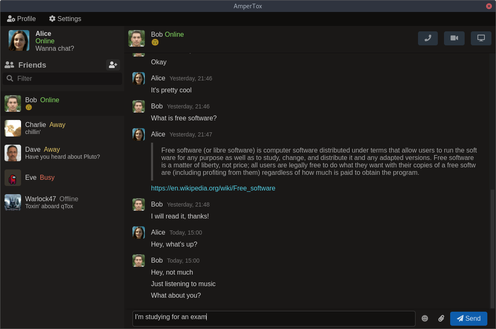

# AmperTox 

Encrypted peer to peer messenger and Tox client for GNU/Linux, Windows and MacOS.



Current features:
- 1 on 1 messaging
- chat history (currently unencrypted)
- avatars (gifs are also supported)
- file transfers work, but there is no UI for them

## Warning
This client is currently in alpha stage. Please **backup your Tox profiles** before using it.

**Note:** there are some huge performance issues with file transfers caused by using toxcore with ffi-napi. This causes very slow transfer speeds and increased CPU usage (only during file transfers).

## Prerequisites
- [toxcore](https://github.com/TokTok/c-toxcore)
- [Node.js 14.x](https://nodejs.org)
- [Python](https://python.org)

## Build from source
```
npm install
npm run build
```
For a release build use `npm run build-prod`.

For development you can instead run `npm run watch`. It will rebuild the UI on changes, but you will still need to restart the app to see them.

## Run
Run `npm run start` to start the app.

## License
All the code is licensed under GPL 3. Assets such as sounds and icons are licensed under CC BY-SA 4.0.